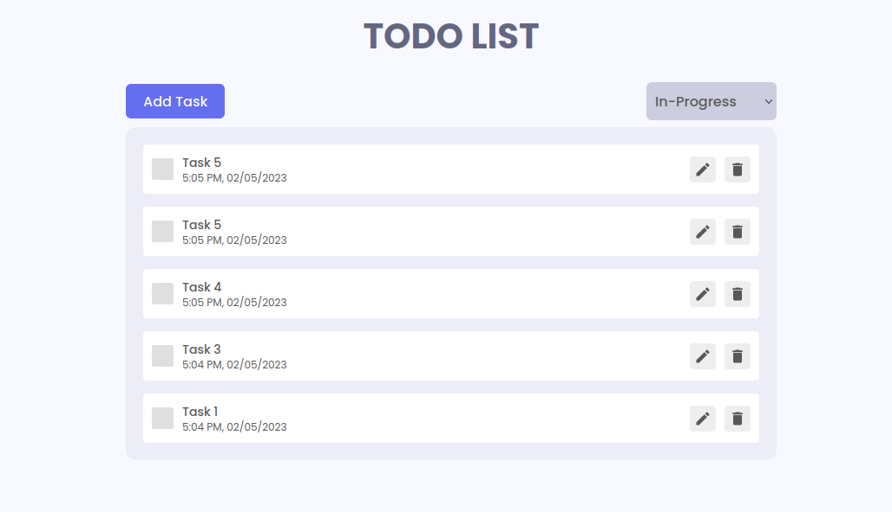

# Modern-Todo-App
This is Modern Todo-App Created with reactJs, Scss, redux-toolkit and localStorage.
Here a user can create Todo with their status(Complete, In-Progress, Incomplete) and can also update to Todo title and status as well.

Filter Todo's:-
- Complete
- In-Progress
- Incomplete

#### Live Preview of Todo App

## Todo App UI

## Add Filter UI

## When Todo Bucket is Empty

